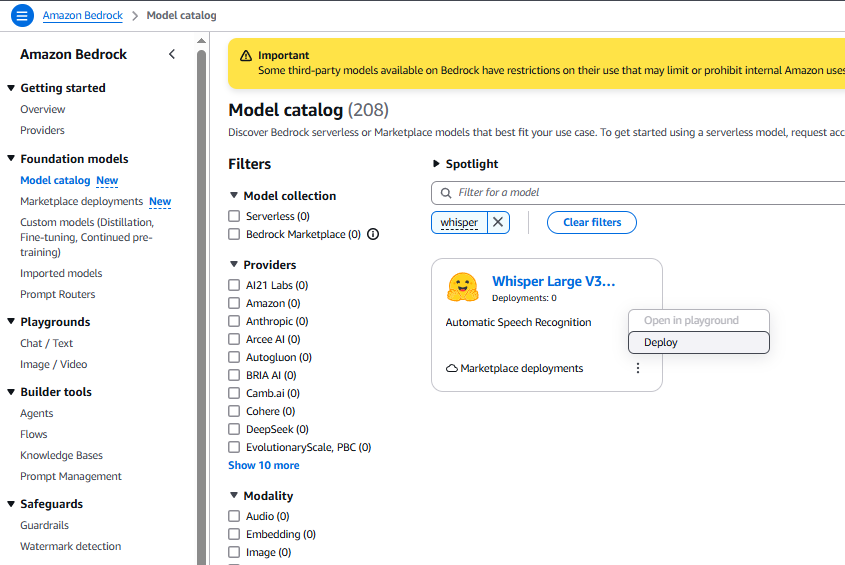
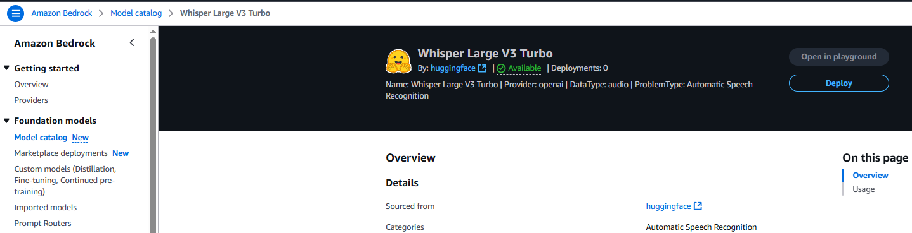
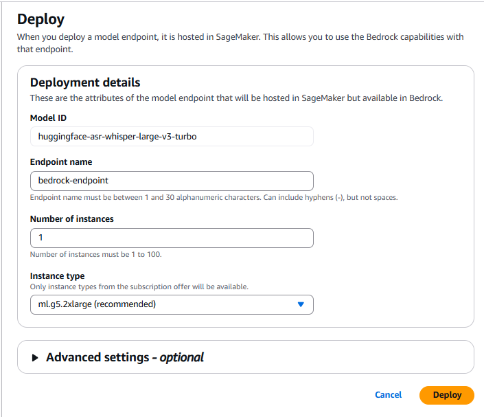
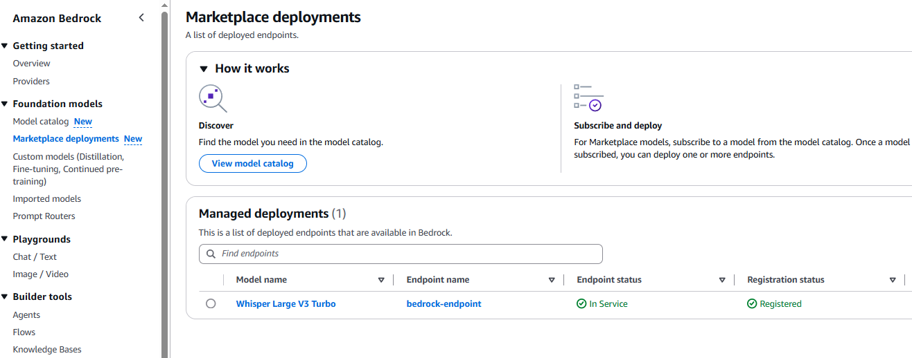
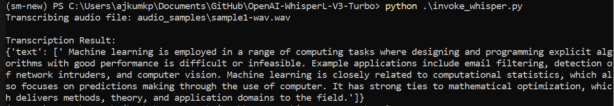
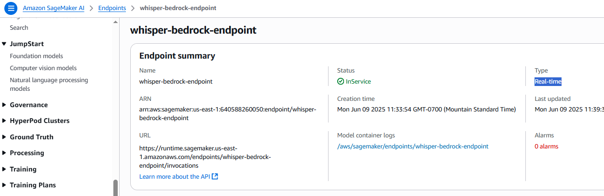

# OpenAI-WhisperL-V3-Turbo

Use this guide to deploy and test Whisper- https://huggingface.co/openai/whisper-large-v3-turbo, on Amazon. 

There are a few different ways to deploy Whisper on Amazon that are described below.

1. Deploy the model from Amazon Bedrock Marketplace- https://docs.aws.amazon.com/bedrock/latest/userguide/amazon-bedrock-marketplace.html. 

1a. Search for Whisper on Bedrock Model catalog  

1b. Deploy the model via Marketplace deployments

Note: As per the Bedrock guide whisper is supported via Invoke_model API-https://docs.aws.amazon.com/bedrock/latest/userguide/bedrock-marketplace-model-reference.html, however, upon testing I found it is NOT true. This is a documentation error that needs to be fixed.

1c. The alternative way to invoke the model is using Sagemaker boto3 client API, as shown in invoke_whisper.py. Here's a sample o/p:

Note: The model deployed via Bedrock marketplace is a Real-time (RT) sagemaker endpoint. You can see the endpoint details via Sagemaker AI console- 
 

However, RT sagemaker endpoint only supports payload sizes up to 6 MB and processing times of 60 seconds. For >6MB files you need to deploy the model on a Async sagemaker endpoint- https://docs.aws.amazon.com/sagemaker/latest/dg/deploy-model-options.html.

2. Deploy the model from SageMaker Jumpstart
TBD

3. Deploy the model from Huggingface to Sagemaker
TBD

4. Deploy using HF DLC 
TBD

 

